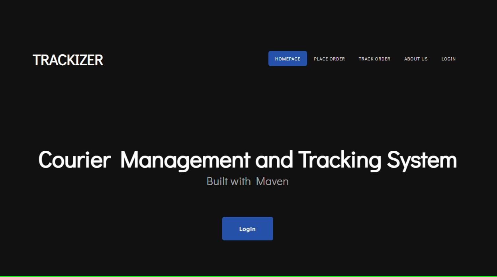
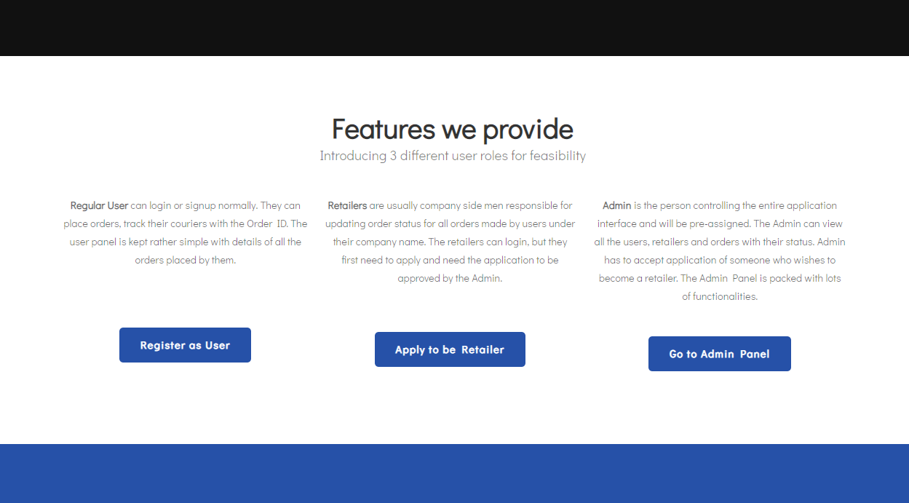
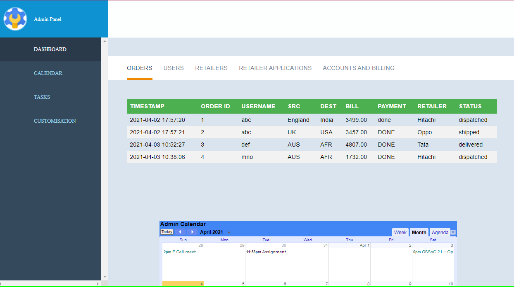
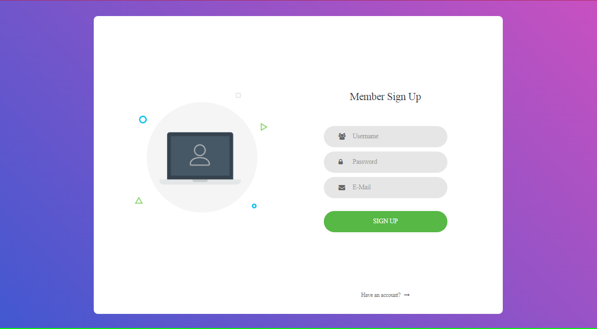
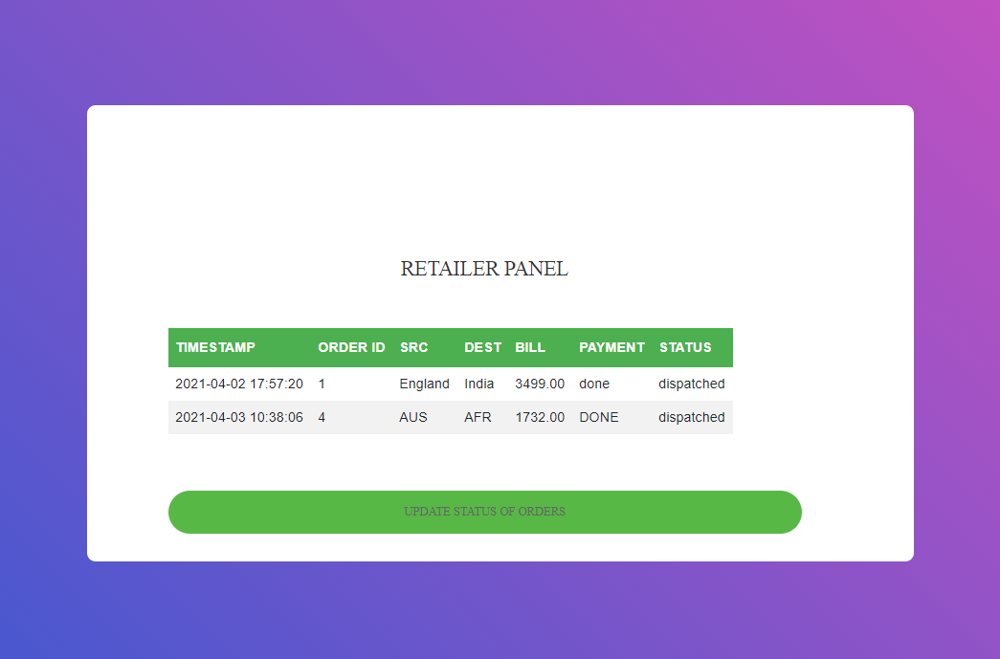

# Trackizer

 
 

Semester Project: Java Project with Maven webapp archetype. Runs on Tomcat server. Uses MySQL for database.

For a quick reference on Apache Maven, check this [tutorial](https://github.com/akshitadixit/Maven-TuT) I wrote for beginners.

### Screenshots (recent):
  
  
  
  

